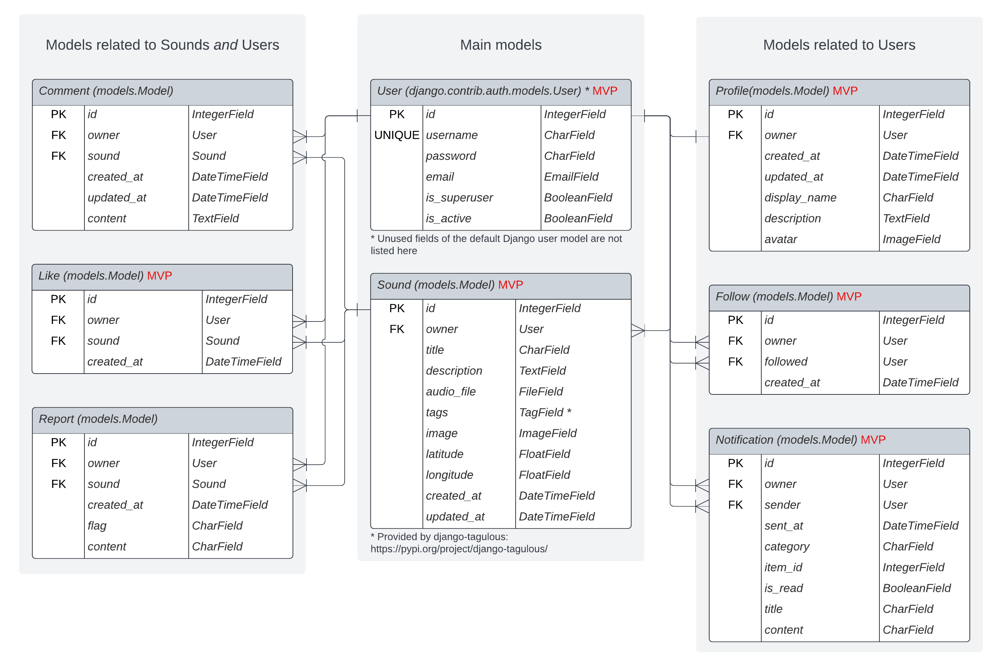

# Sonic Explorers API

The **Sonic Explorers API** is a Django Rest Framework API for social media applications with a focus on sound recordings and geolocation data. The API is primarily used for the [Sonic Explorers](https://github.com/nacht-falter/sonic-explorers) app, a social media app for recording and sharing sounds, but could also be adapted for other social media applications centered around sound recordings.

The API is designed to support uploading sounds including geolocation data and provides endpoints for social media interactions between users.

Key features:

- User authentication
- Endpoints for sound upload, audio processing and storage
- Store geolocation data with sounds
- Tagging system for sounds
- Endpoints for user interactions (Profiles, Likes, Comments, Followers)
- Notification system for user interactions

The deployed API can be found here: [Sonic Explorers API](https://sonic-explorers-api-4c187c4cd99f.herokuapp.com/)

## Table of Contents

...

## Features

### Existing Features

- **User Authentication API Endpoints**: Users can sign up and login. User profiles are automatically created upon sign-up.
- **Sound File Upload API Endpoints**: Upload sound files to the cloud storage. Sound files are automatically trimmed and compressed before being stored.
- **Tagging API Endpoints**: Users can assign tags to sound in order to categorize and sort sounds.
- **User Interaction API Endpoints**: Authenticated users can follow each other and like or comment on each other's sounds.
- **Sound Reporting API Endpoints**: Users can report sounds if they have concerns about the uploaded content.
- **Notification API Endpoints**: User-specific notifications are automatically generated for follows, likes, comments, and reports.
- **Advanced Result Control**: The API provides options for filtering, searching, and sorting for fine-tuning API results.

### Future Feature Ideas

- Direct messaging between users
- Advanced audio processing and editing (e.g., audio filters, custom audio trimming, sound remixes)
- Gamification features such as Sound challenges, Badges, Leaderboard

## Design Process

The design process for the API involved the following steps:

1. **Strategy**: Defining overall project goals (see https://github.com/nacht-falter/sonic-explorers)
2. **Scope**: Defining API requirements by writing [user stories for the front end application](https://github.com/nacht-falter/sonic-explorers) and subsequently defining [user stories for the API itself](#user-stories), with a Minimum Viable Product (MVP) approach in mind.
3. **Structure**: Designing the [data models](#data-models) and outlining [API endpoints](#api-endpoints).

The **Skeleton** and **Surface** design planes are part of the design process for the [front end application](https://github.com/nacht-falter/sonic-explorers).

### User Stories

For the API side of the project I created a separate set of user stories, written from the perspective of a developer consuming the API. The API User Stories can be found here: [Sonic Explorers API User Stories](docs/USERSTORIES.md)

### Data Models

The following custom models have been implemented in the project. The relationship between these models is outlined in the entity relationship diagram below. The diagram also shows, which models make up the Minimum Viable Product (MVP).

#### Profile Model

The Profile model represents user profiles with a one-to-one relationship with the default User model. It provides additional fields for uploading a profile image (*avatar*) and providing a *display_name* and a *description*. Profiles are automatically created when a new user is created.

#### Sound Model

The Sound model provides fields for uploading audio files and providing metadata, such as *title*, *description*, *tags*, an *image*, and geolocation data. The *tags* field is implemented using [django-tagulous](https://pypi.org/project/django-tagulous/).

The *audio_file* field is a custom field handling the file upload to [Cloudinary](https://cloudinary.com/) and processing (compressing and trimming) the uploaded audio file using Cloudinary's [audio transformation features](https://cloudinary.com/documentation/audio_transformations).

Together with the User model, the Sound modal makes up the core of the application. All other models are related to either the Sound model or the User model, or both.

#### Like and Comment Models

The Like and Comment model provide similar functionality: Both are related to the Sound and User model and allow users to like or comment on sound instances. While Like instance can only be created or deleted and have no *content* field, Comments can be updated and provide a *content* field for the comment.
 
#### Follow Model

The Follow model connects two User instances by defining a follow relationship. The owner of the Follow instance is the user who is following the user defined in the *followed* field of the model.

#### Notification Model

The Notification model is used to notify users about the actions of other users. Notifications will be automatically created, when users follow another user, like or comment on a user's sounds, or when followed users upload new sounds. Also, staff users will receive notifications when users create new reports so that they can review the reported sound.

The Notification model includes a reference to the user whose action triggered the notification (sender) and fields to store the notification category, the ID of related sound or follow, a *title* and the *content*, and a field to store the read/unread status (*is_read*).

#### Report Model

Similar to the Comment model, the Report model is related to the Sound and the User model. It allows users to create a report for a sound, if they are concerned about the uploaded contents. The model provides a *flag* field with choices for different report categories and a *content* field.

## API Endpoints

The Sonic Explorers API provides the following endpoints:

| Endpoint | HTTP Method | CRUD | View Type | Permissions | Filter/Search |
|---|---|---|---|---|---|
| **Authentication and Profiles** |
| /api-auth/login/ | GET | N/A | N/A | Public |  |
|  | POST | N/A | N/A | Public |  |
| /api-auth/logout/ | GET | N/A | N/A | Public |  |
| /dj-rest-auth/registration/ | POST | N/A | N/A | Public |  |
| /dj-rest-auth/login/ | POST | N/A | N/A | Public |  |
| /dj-rest-auth/logout/ | POST | N/A | N/A | Authenticated |  |
| /profiles/ | GET | Read | List | Public | Filters: "followers", "following" |
| /profiles/\<int:pk\>/ | GET | Read | Detail | Public |  |
|  | PUT | Update | Detail | Owner |  |
| **Sound-related Endpoints** |
| /sounds/ | GET | Read | List | Public | Filters: "following", "liked", "user", "tag" Search fields: "owner", "title", "description", "tags" |
|  | POST | Create | List | Authenticated |  |
| /sounds/\<int:pk\>/ | GET | Read | Detail | Public |  |
|  | PUT | Update | Detail | Owner |  |
|  | DELETE | Delete | Detail | Owner |  |
| /tags/ | GET | Read | List | Public |  |
| /tags/\<int:pk\>/ | GET | Read | Detail | Public |  |
| **User Interaction Endpoints** |
| /likes/ | GET | Read | List | Public |  |
|  | POST | Create | List | Authenticated |  |
| /likes/\<int:pk\>/ | GET | Read | Detail | Public |  |
|  | DELETE | Delete | Detail | Owner |  |
| /comments/ | GET | Read | List | Public | Filters: "sound" |
|  | POST | Create | List | Authenticated |  |
| /comments/\<int:pk\>/ | GET | Read | Detail | Public |  |
|  | PUT | Update | Detail | Owner |  |
|  | DELETE | Delete | Detail | Owner |  |
| /follows/ | GET | Read | List | Public |  |
|  | POST | Create | List | Authenticated |  |
| /follows/\<int:pk\> | GET | Read | Detail | Public |  |
|  | DELETE | Delete | Detail | Owner |  |
| **Reports and Notifications** |
| /reports/ | GET | Read | List | Admin | Filters: "sound", "user", "flag" |
|  | POST | Create | List | Authenticated |  |
| /reports/\<int:pk\> | GET | Read | Detail | Admin |  |
|  | DELETE | Delete | Detail | Admin |  |
| /notifications/ | GET | Read | List | Owner |  |
| /notifications/\<int:pk\> | GET | Read | Detail | Owner |  |
|  | DELETE | Delete | Detail | Owner |  |

## Agile Methodology

### GitHub Issues and Projects as Agile Tools

[GitHub Issues](https://docs.github.com/en/issues) and [GitHub Projects](https://docs.github.com/en/issues/planning-and-tracking-with-projects/learning-about-projects/about-projects) were used as tools for Agile methodology.

- I used [Issues](https://github.com/nacht-falter/sonic-explorers-api/issues?q=is%3Aissue+is%3Aclosed) to define user stories. 

- I assigned labels to user stories to categorize them into [Themes](https://github.com/nacht-falter/sonic-explorers-api/labels?q=THEME) and [Epics](https://github.com/nacht-falter/sonic-explorers-api/labels?q=EPIC)

- All user stories were prioritized using the MoSCoW prioritization technique with the following project-wide priorities:

  https://github.com/nacht-falter/sonic-explorers-api/labels/PRIORITY%3A%20Must-Have https://github.com/nacht-falter/sonic-explorers-api/labels/PRIORITY%3A%20Should-Have https://github.com/nacht-falter/sonic-explorers-api/labels/PRIORITY%3A%20Could-Have https://github.com/nacht-falter/sonic-explorers-api/labels/PRIORITY%3A%20Won%27t-Have

- I used Milestones for the [Product Backlog](https://github.com/nacht-falter/sonic-explorers-api/milestone/1) and for adding user stories to [Sprints](https://github.com/nacht-falter/sonic-explorers-api/milestones?state=closed).

- [Projects](https://github.com/nacht-falter/sonic-explorers-api/projects?query=is%3Aclosed) were used for tracking tasks within each iteration.

- [Project workflows](https://docs.github.com/en/issues/planning-and-tracking-with-projects/automating-your-project/adding-items-automatically) were used to automatically add user stories in a sprint to the To-do column of the corresponding project board.

- For sprint-wide prioritization, a [custom priority field](https://docs.github.com/en/issues/planning-and-tracking-with-projects/understanding-fields) was used.

### Sprint Planning

The development process was planned with three timeboxed sprints of three days each. User stories were assigned to sprints with the MVP in mind, but at the same time making sure, not to assign more than 60% Must-Have user stories to a sprint. 

#### Sprint 1 (Sept. 13 to 15 2023)

Show sprint details

- Initial Setup
- User registration and authentication
- User Profiles endpoints
- Sound endpoints and audio processing

All items completed on Sept. 15 2023

[Sprint Details](https://github.com/nacht-falter/sonic-explorers-api/milestone/2?closed=1)

[Sprint Project Board](https://github.com/users/nacht-falter/projects/16)

#### Sprint 2 (Sept. 16 to 18 2023)

Show sprint details

- Tagging system for sounds and tag endpoints
- Like and Comment endpoints
- Follow/Unfollow endpoints
- Notification endpoints and automation

All items completed on Sept. 18 2023 

[Sprint Details](https://github.com/nacht-falter/sonic-explorers-api/milestone/3?closed=1)

[Sprint Project Board](https://github.com/users/nacht-falter/projects/17)

#### Sprint 3 (Sept. 19 to 21 2023)

Show sprint details

- Report endpoints
- Filtering and sorting functionality
- Testing
- Bug fixes
- Documentation

All items completed on Sept. 21 2023 

[Sprint Details](https://github.com/nacht-falter/sonic-explorers-api/milestone/4?closed=1)

[Sprint Project Board](https://github.com/users/nacht-falter/projects/18)

## Technologies Used

### Frameworks and Languages

The API is built with [Django Rest Framework](https://www.django-rest-framework.org/), a [Django](https://www.djangoproject.com/) based toolkit for building APIs with Python.

### Additional Python Packages

- [gunicorn](https://pypi.org/project/gunicorn/): WSGI server used for deployment 
- [psycopg2](https://pypi.org/project/psycopg2/): PostgreSQL database integration
- [dj-database-url](https://pypi.org/project/dj-database-url/): Django database management 
- [cloudinary](https://pypi.org/project/cloudinary/): Cloudinary integration
- [django-cloudinary-storage](https://pypi.org/project/django-cloudinary-storage/): Using Cloudinary as Django file storage
- [django-allauth](https://pypi.org/project/django-allauth/): Advanced authentication and user management for Django 
- [dj-rest-auth](https://pypi.org/project/dj-rest-auth/): Advanced DRF authentication (Version 2.2.8 or older has to be used in order for the custom UserSerializer functionality to work)
- [django-cors-headers](https://pypi.org/project/django-cors-headers/): Handle Cross-Origin Resource Sharing in Django
- [django-filter](https://pypi.org/project/django-filter/): Provides filtering with URL parameters for querysets
- [django-tagulous](https://pypi.org/project/django-tagulous/): Tagging library for Django
- [coverage](https://pypi.org/project/coverage/): Analyzing test coverage

### Other Software

- [GitHub](https://github.com/) is used to store all project files in the [repository](https://github.com/nacht-falter/sonic-explorers-api)
- [GitHub Issues](https://docs.github.com/en/issues) have been used for Agile methodology by assigning user stories to issues and using labels to organize user stories.
- [GitHub Projects](https://docs.github.com/en/issues/planning-and-tracking-with-projects/learning-about-projects/about-projects) have been used for Agile sprint planning and task tracking.
  [The project boards for all sprints can be found here](https://github.com/nacht-falter/sonic-explorers-api/projects?query=is%3Aclosed).
- The [GitHub CLI](https://cli.github.com/) was used for creating issues from the terminal.
- [Git](https://git-scm.com/) was used for version control by committing changes to Git and pushing them to GitHub from the command line.
- [Heroku](https://heroku.com/) is used to [deploy the API](#deployment).
- [ElephantSQL](https://www.elephantsql.com/) is used for the project's PostgreSQL database.
- [Cloudinary](https://cloudinary.com/) is used to store media files and for processing uploaded audio files.
- [Lucidchart](https://www.lucidchart.com/) was used to create the [entity relationship diagram (ERD)](#data-models).
- [Postman](https://www.postman.com/) has been used for testing all API endpoints.
- [Neovim](https://neovim.io/) was used for writing code.
- https://derlin.github.io/bitdowntoc/ has been used to create the [table of contents](#table-of-contents) in this README.

## Testing

[All project testing procedures have been documented here](docs/TESTING.md).

## Deployment

The project was deployed to [Heroku](https://heroku.com). A live version of the API can be found at https://sonic-explorers-api-4c187c4cd99f.herokuapp.com/.

The necessary steps to deploy the project are:
1. Clone or fork the repository. For forking it, go to https://github.com/nacht-falter/sonic-explorers-api/, click on `Fork` and follow the instructions. For cloning the repository run `git clone https://github.com/nacht-falter/sonic-explorers-api.git` in your terminal.

    

    
Show image

    
    

2. Create an account at https://cloudinary.com and get your Cloudinary URL from the dashboard by clicking on the URL under `API Environment variable`.

    

    
Show image

    
    

3. Create a PostgreSQL database, for example at https://www.elephantsql.com/. Create an account and after login in, click on `Create new instance` and follow the instructions. Click on your newly created database and get the URL from the database details.

    

    
Show image

    
    

4. Create an account at https://heroku.com and login. Then, start a new app from the [Heroku dashboard](https://dashboard.heroku.com) by clicking on `New` and then on `Create new app`.

    

    
Show image

    
    

5. Give your app an available name and choose your region (US or Europe).

6. After creating your app, go to the *Settings* tab and click on `Reveal Config Vars` in the *Config Vars* section.

    

    
Show image

    
    

7. Now, one by one, add the following config vars:

    | Name | Value | 
    |---|---|
    | ALLOWED_HOSTS | \<your deployed heroku API app url\> * |
    | CLIENT_ORIGIN_DEV | \<your development environment url\> ** |
    | CLIENT_ORIGIN | \<your client url\> |
    | CLOUDINARY_URL | \<Your cloudinary url\> | 
    | DATABASE_URL | \<Your database url\> | 
    | DISABLE_COLLECTSTATIC | 1 |
    | SECRET_KEY | \<some random string\> |

    \* Paste the URL without 'https://' or a trailing slash!

    \*\* E.g. "http://localhost:3000" for building a React front end app in a local environment. This may differ for your IDE.

    

    
Show image

    
    

8. Click on the *Deploy* tab and connect the Heroku app to your GitHub repository.

    

    
Show image

    
    

9. Scroll down and choose the branch you want to deploy in the *Manual deploy* section. Now click on `Deploy Branch` for the first deployment of the application.

    

    
Show image

    
    

10. After deployment click on `View` to open your deployed app.

    

    
Show image

    
    

11. In case you run into any issues you can access logs by clicking on `More` and then `View logs` or you can check the *Activity* tab for debugging.

    

    
Show image

    
    

## Credits

The initial setup and the general structure of the project are based on the instructions from the Code Institute *Django Rest Framework* walkthrough project ([source code](https://github.com/Code-Institute-Solutions/drf-api/)). The basic structure of the Profile, Like, Comment, and Follow models (and their serializers), as well as the filtering functionality has been adopted from the walkthrough project and adjusted to fit the specific circumstances of the project.

Additionally, I made extensive use of the following documentation:

- [Django documentation](https://www.djangoproject.com/)
- [Django Rest Framework documentation](https://www.django-rest-framework.org/)
- [django-filter documentation](https://django-filter.readthedocs.io/en/stable/)
- [django-tagulous documentation](https://django-tagulous.readthedocs.io/en/latest/)
- [Cloudinary documentation](https://cloudinary.com/documentation)

Individual documentation pages that have been used are referenced in the code.

All other sources used during development are listed here (all code from these sources has been thoroughly reviewed, understood and adapted to the specific circumstances of this project). References to the sources can also be found in the code.

- Instructions for Django signals: https://www.geeksforgeeks.org/how-to-create-and-use-signals-in-django/
- Prevent Users from self-following: https://adamj.eu/tech/2021/02/26/django-check-constraints-prevent-self-following/
- Conditionally truncate a string in Python: https://stackoverflow.com/a/52279347
- Print test ID for each test: https://docs.python.org/3/library/unittest.html#unittest.TestCase.id
- Mock a file upload for testing: https://stackoverflow.com/a/20508621
- Avoiding TransactionManagementError in unit tests from: https://stackoverflow.com/a/23326971

### Acknowledgements

- I would like to thank my Code Institute mentor Mo for his support and constructive advice.
- I would like to thank the Code Institute tutors for their helpful support.
